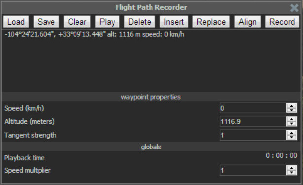

### Creating a flight path video with smooth transitions

Converting the final output video documentation will be added soon.

####   Outerra default basic controls used:

For mac, use CMD in place of CTRL

<table>
<tr>
<td>p</td>
<td>:</td>
<td>open/close console</td>
</tr>
<tr>
<td>CTRL + p</td>
<td>:</td>
<td>open/close flight path recorder</td>
</tr>
<td>F9</td>
<td>:</td>
<td>start/stop screen recording</td>
</tr>
<tr>
<td>mouse left-click</td>
<td>:</td>
<td>shoot gun</td>
</tr>
</table>

####   Smooth flight path

Before recording (logging) the flight path, you'll want to fly to a location near your first desired point- you'll see what happens when the path is recording (you can't load and fly a path with 0 km/h speed, we'll delete these bad points at the end).

Read through the steps before recording your first path.

1. Open Outerra
2. Record (log) path:   - You'll have to rename the flight path file for each unique flight path, or you'll overwrite your flight path (see step 6.1 to locate and rename flight path file)
  1. Fly to a location near your desired path (read above paragraph)
  2. Open flight path recorder: CTRL + P (mac = CMD + P) 
  
  3. Click RECORD  to start recording flight:   - You'll start seeing the points being logged in the Flight Path Recorder window
  
  4. Start flying!
    1. Hold down mouse left-click and fly with the standard W,A,S,D controls   - It's recommended to have a longer flight into your path (outerra notes will appear on the bottom-left of the screen in white text, we'll cut this out), rather than starting in the middle of the area you want to record   - You'll notice the points being logged with speed   - You may have to test this step out a few times   - - Adjust your speed, try going slower (we can speed up the path in the flight path file)   - - Sometimes the flight will continue flying even after releasing the buttons. To fix this: release all buttons, hold down left-click and type/push W. This will (does at the moment) disable the "autopilot" quirk.
  5. Click RECORD to stop recording flight:   - Scroll through your points and delete any with speed: 0 km/h    - You'll fly into the middle of the earth (black screen) if you have any points with 0 km/h
  6. Click SAVE  to save points to file (or you won't have points to fly to!)
  7. Click X (top-right)  to close flight path recorder
3. Auto-fly your path: ALT + p    - Test out your path   - Start the flight path recorder over if you're not satisfied (step 2.1)
4. Record (screen) path:
  1. Load and fly logged (recorded) path: ALT + p
  2. Record (screen): F9   - Be quick!   - You'll see the red 'recording' blinking light at the top-left of the Outerra window 
  
  3. Stop recording (screen): F9   - The screen recorder will continue recording until you stop recording. This will result in a longer video and it'll have to be cut down
5. Export video:
  1. Close Outerra   - You'll be prompted (v0.8.4.5377) with Outerra Video Converter- don't close this window! 
  
  2. From Outerra Video Converter: 
    1. Click START to convert all screen recordings   - Screen recordings are stored in .y4m format (raw format), the converter converts them into .webm, an open video format (you can play this .webm in a web browser)
    2. The 'videos' folder should open, or click OPEN FOLDER to video files 
    3. Open converted file   - Named something like, capture&#95;1429811867. The numbers attached to the name 'capture&#95;' are a Unix timestamp
    4. Rename file if necessary
6. Locate flight path file:
  1. C:\Users\daniel\Outerra\demo.path -- my username is 'daniel'   - This path is by Outerra default installation   - Rename file if necessary, e.g. aspen-resort-demo.path   - You can remove this file from the folder (Outerra will create a new demo.path)   - Rename any flight path file to demo.path (must be located in this folder) and Outerra will load it (click LOAD in flight path recorder)

#### Things to Consider:

- When clicking SAVE in flight path recorder, the demo.path file will be overwritten with the points that are currently display in the flight path recorder. Be sure to SAVE, then locate and rename your flight path you'd like to save for later, before creating a new flight path.
- Rename any flight path file to demo.path (must be located in C:\Users\yourusername\Outerra\ ) and Outerra will load it (click LOAD in flight path recorder). 
- Give yourself a buffer zone when recording a path- you'll want to cut the first 4-ish second out of the video to rid of the Outerra notes on the bottom-left of the screen.
- Be sure all items/windows within Outerra are closed during screen recording (F9) so they're not recorded in the video, e.g. sometimes the console is open (transparent window with warnings, errors, or other messages).

